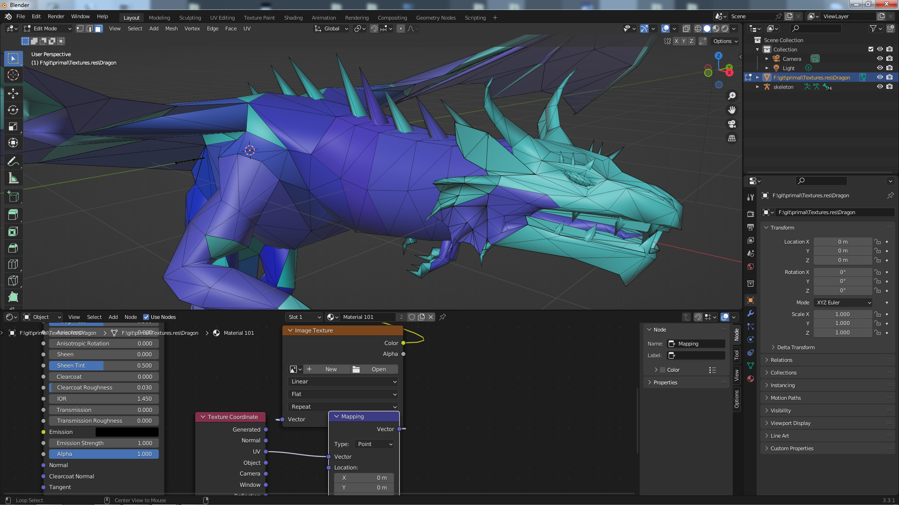

# Описание

Форматы файлов и инструменты для игр Primal Software. Описание форматов в виде шаблонов для 16ричного редактора.

## Форматы

#### 1. Глаз Дракона (2002)
| № | Format/Ext  | Template (010 Editor) |  Description   |
| :-- | :------- | :-- |  :-- | 
|  **1**  | MESH | [MESH.bt](templates/010editor/MESH.bt)  | трехмерные модели | 
|  **2**  | ANM | [ANM.bt](templates/010editor/ANM.bt)  | анимации для трехмерных моделей | 
|  **3**  | LAND | [ANM.bt](templates/010editor/LAND.bt)  | Поверхность уровня (карта высот) | 

    Как использовать шаблоны  010Editor
    0. Установить 010Editor.
    1. Открыть нужный файл игры.
    2. Применить шаблон через меню Templates-Run template.   
## Инструменты

#### 010editor

| № | Скрипт | Описание  |
| :-- | :------- | :-------  | 
|  **1**  | [Decipher_dat_dsc.1sc](scripts/Decipher_dat_dsc.1sc)  | Расшифровка/Зашифровка текстовых файлов игры Глаз Дракона (2002) |

Текстовые файлы в игре зашифрованы с помощью xorа, к ним относятся файлы с раширением .dat, .dsc, .city, .fir. Скрипт позволяет их расшифровать и зашифровать обратно (повторить скрипт на расшифрованном файле).

    Как использовать скрипты  010Editor
    0. Установить 010Editor.
    1. Открыть нужный .dat файл.
    2. Применить скрипт через меню Script-Run script. 

#### Blender

| № | Плагин | Описание   | Статус |
| :-- | :------- | :-------  | :-------  | 
|  **1**  | [__init__.py](plugins/blender/io_scene_idragon_mesh/__init__.py)  | Просмотр файлов моделей mesh игры Глаз Дракона (2002) | +модели +текстуры |

    Как установить плагин Blender
    0. Найти в интернете "как установить плагин для Blender". Дальше не читать.
    1. Скопировать папку с плагином в папку Blender/x.x/scripts/addons....
    2. Запустить Blender, зайти в настройки (клавиши Ctrl + Alt + U или в меню Edit-Preferencies).
    3. В списке слева выбрать addons, найти плагин в списке и активировать его, нажав на квадрат.
    4. Открыть файл через меню **File-Import**, справа в поле настроек можно написать название текстуры, чтобы плагин сам загрузил текстуру, она должна быть в одной папке с файлом модели, если нет, то зайти в Shader Editor и задать файл вручную. 

#### Noesis

| № | Плагин | Описание   | Статус |
| :-- | :------- | :-------  | :-------  | 
|  **1**  | [fmt_idragon_msh.py](plugins/noesis/fmt_idragon_msh.py)  | Просмотр файлов моделей mesh игры Глаз Дракона (2002) | +модели +текстуры +кости +-анимации |

    Как использовать Noesis плагины
    1. Скачать Noesis https://richwhitehouse.com/index.php?content=inc_projects.php&showproject=91 .
    2. Скопировать скрипт в папку ПапкасNoesis/plugins/python.
    3. Открыть Noesis.
    4. Открыть файл через File-Open.
    
#### QuickBms

| № | Скрипт | Описание  |
| :-- | :------- | :-------  | 
|  **1**  | [idragon_unpack_res.bms](scripts/idragon_unpack_res.bms)  | Скрипт для распаковки файлов игры |   

    Как использовать quickbms скрипты
    1. Нужен quickbms https://aluigi.altervista.org/quickbms.htm
    2. Для запуска в репозитории лежит bat файл с настройками, нужно открыть его и задать свои пути: до места, где находится quickbms, папки с игрой и места куда нужно сохранить результат.
    3. Запустить процесс через bat файл или вручную (задав свои параметры для запуска quickbms, документация на английском есть здесь https://aluigi.altervista.org/papers/quickbms.txt ). 

***

# primal-file-formats

File formats and tools for games by Primal Software.

## Formats
| № | Format/Ext  | Template (010 Editor) |  Description   |
| :-- | :------- | :-- |  :-- | 
|  **1**  | MESH | [MESH.bt](https://github.com/AlexKimov/primal-file-formats/blob/master/templates/010editor/MESH.bt)  | models | 
|  **2**  | ANM | [ANM.bt](https://github.com/AlexKimov/primal-file-formats/blob/master/templates/010editor/ANM.bt)  | animations | 

## Tools

#### QuickBMS 

| № | .bat file | Script  | Description   |
| :-- | :------- | :-------  | :-- |
|  **1**  | [run_res.bat](https://github.com/AlexKimov/primal-file-formats/blob/master/scripts/run_res.bat) | [idragon_unpack_res.bms](https://github.com/AlexKimov/primal-file-formats/blob/master/scripts/idragon_unpack_res.bms) | unpack resource files |

#### Blender

| № | Plugin | Description   |
| :-- | :------- | :-------  | 
|  **1**  | [_init__.py](https://github.com/AlexKimov/primal-file-formats/blob/master/plugins/blender/io_scene_idragon_mesh/__init__.py)  | Plugin to open mesh files |

    How to:
    1. Install Blender (~3.3).
    2. Go to Preferencies - Add-ons section - Testing. Check plugin to activate.
    3. Go to menu File - Import - "Plugin" and choose .mesh file to import.

#### Noesis

| № | Plugin | Description   |
| :-- | :------- | :-------  | 
|  **1**  | [fmt_idragon_msh.py](plugins/noesis/fmt_idragon_msh.py)  | Plugin to open mesh files |

