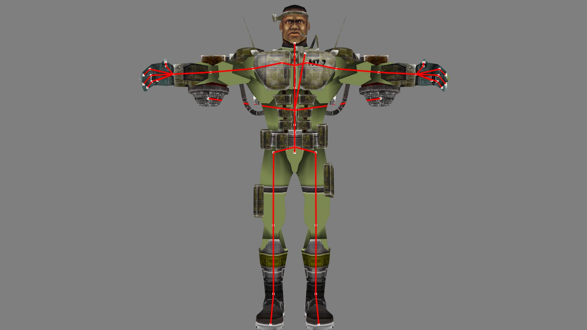
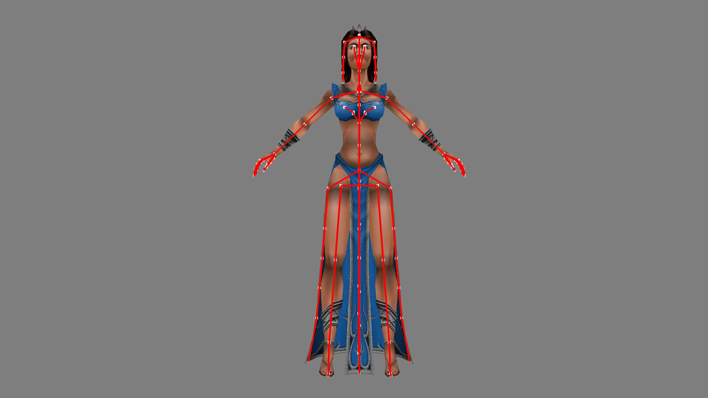
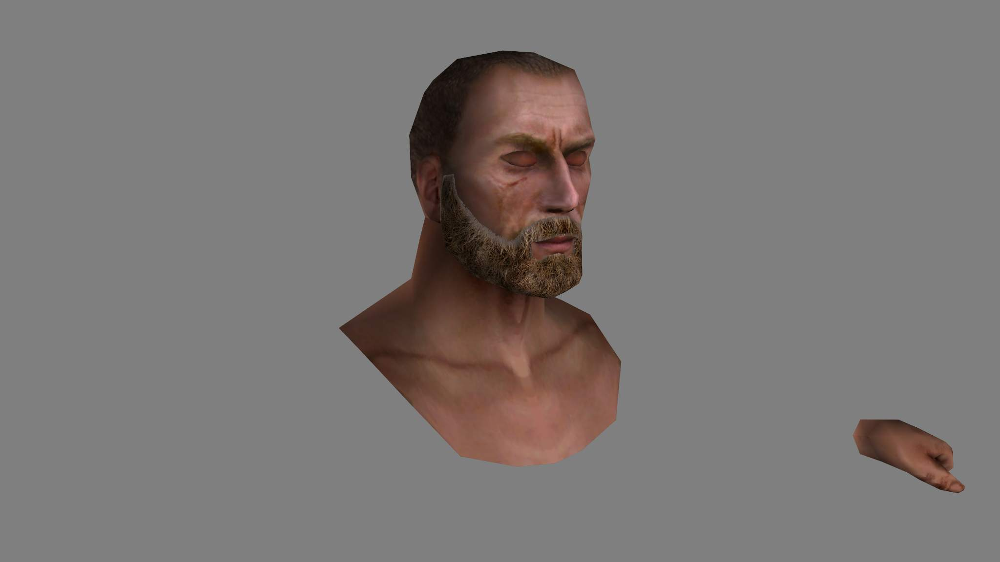

# Описание

Форматы файлов и инструменты для игр от Primal Software. Описание форматов в виде шаблонов для 16ричного редактора.  

[Blender plugin](https://github.com/XenonBaruku/IDragon-Blender-Tools)

### Краткое введение в форматы файлов

##### Отличие между форматами игр  
В играх Глаз Дракона, Осада и Волкодав Месть Серого Пса используются схожие форматы файлов. В Осаде были добавлены упрощенные форматы для моделей и их анимаций.
##### Игровые ресурсы   
Часть файлов хранится в архивах RES (модели, текстуры, анимации, а также "забытые" файлы, например, файлы 3dsmax). Сжатие данных не используется.
##### Форматы для моделей и текстур  
Для текстур используются форматы DDS и TGA, которые хранятся отдельно в соответствующих файлах, а также в файлах ETL хранятся текстуры в DDS формате. Модели в игре лежат в файлах MSH. Анимации для моделей в файлах ANM. Локации в игре разбиты на несколько файлов: LAND для геометрии, ETL для детализации, LIGHT - лайтмапы и другие.  
##### Другое 
Текстовые файлы, которые содержат различные параметры объектов и настройки, зашифрованы (ниже).

### Вопросы/Ответы
0. Текущий статус? Где что лежит и что с этим делать?   
   На данный момент исследованы форматы моделей, анимации, файлы ресурсов. Их можно загружать и просматривать, есть описание форматов для создание своих программ.
   В папке **plugins** плагины для работы с файлами игр, в папке **scripts** инструменты для работы с файлом ресурсов .res и расшифровки текстовых файлов в игре.
   В папке **templates** шаблоны форматов для программы 010Editor.
1. Что планируется сделать?    
   См. ([ссылка](#задачи)) . Планов как таковых нет, но вы можете поучаствовать и сделать все, что вам нужно, самостоятельно. 
2. Как распаковать и запаковать архивы игры .res?  
    * Использовать плагин для Noesis ([ссылка](#noesis)).   
    * Использовать скрипт для Quickbms ([ссылка](#quickbms)). Только распаковка.
    * Или python скрипты ([ссылка](#python)).
3. Как достать модели из игры Глаз Дракона? Как вытащить модели из игры Осада? Как получить модель Волкодава? Как открыть файл .msh?  
   * Использовать плагин для Blender ([ссылка]([#blender](https://github.com/XenonBaruku/IDragon-Blender-Tools))). 
   * Использовать плагин для Noesis ([ссылка](#noesis)). Считываются все данные и отображаются анимации.    
4. Как открыть, изменить файлы .city, .dsc, .dat, .fir и другие?  
   Использовать скрипт для 010Editor ([ссылка](#010editor)).  

### Задачи

##### Глаз дракона (2002) / Осада (2004) / Волкодав Месть Серого Пса (2006)
- [ ] Анализ форматов  

      [+] Модели  
      [+] Текстуры  
      [+] Скелет  
      [+] Веса/индексы костей  
      [+] Анимации
      [+] Карта Высот      
      [+] Спрайты  
      [+] Расположение объектов 
      [-] Лайтмапы  
          
- [ ] Плагин BLENDER для просмотра .msh файлов

      [+] Модели  
      [+] Текстуры  
      [-] Скелет  
      [-] Анимации  
      
- [x] Плагин Noesis для просмотра .msh файлов

      [+] Модели  
      [+] Текстуры  
      [+] Скелет  
      [+] Анимации  

- [ ] Плагин BLENDER для просмотра .land файлов

      [-] Карта высот  
      [-] Текстуры/Спрайты
      [-] Лайтмапы 
      [-] Объекты, модели 
      
## Форматы

#### Глаз Дракона (2002)
| № | Формат  | Шаблон (010 Editor) |  Описание   |
| :-- | :------- | :-- |  :-- | 
|  **1**  | MESH | [MESH.bt](templates/010editor/MESH.bt)  | трехмерные модели | 
|  **2**  | ANM | [ANM.bt](templates/010editor/ANM.bt)  | анимации для трехмерных моделей | 
|  **3**  | LAND | [LAND.bt](templates/010editor/LAND.bt)  | Поверхность уровня (карта высот) | 
|  **4**  | ETL | [LAND.bt](templates/010editor/ETLs.bt)  | Тайлы детализации поверхностей уровня |  
|  **5**  | SCBN | [SCBN.bt](templates/010editor/SCBN.bt)  | Объекты на уровне | 

#### Осада (2004) / Волкодав Месть Серого Пса (2006)
| № | Формат  | Шаблон (010 Editor) |  Описание   |
| :-- | :------- | :-- |  :-- | 
|  **1**  | ANM | [ANM.bt](templates/010editor/ANM.bt)  | (некоторые) анимации для трехмерных моделей | 
|  **2**  | ANM | [ANM_besieger.bt](templates/010editor/ANM_besieger.bt)  | (большая часть) анимации для трехмерных моделей | 
|  **3**  | MESH | [MESH.bt](templates/010editor/MESH.bt)  | (некоторые) трехмерные модели | 
|  **4**  | MESH | [MESH_besieger.bt](templates/010editor/MESH_besieger.bt)  | (большая часть) трехмерные модели |
|  **5**  | LAND | [LAND.bt](templates/010editor/LAND.bt)  | Поверхность уровня (карта высот) | 

    Для чего нужны шаблоны
    Отображение структуры файла в удобном для изучения и редактирования виде, другими словами - описание формата файла.
    
    Как использовать шаблоны 010Editor
    0. Установить 010Editor.
    1. Открыть нужный файл игры.
    2. Применить шаблон через меню Templates-Run template.   
    
## Инструменты

#### python
| № | Скрипт | Описание  |
| :-- | :------- | :-------  | 
|  **1**  | [process_res.py](scripts/process_res.py)  | Распаковка, запаковка файлов .res Глаз Дракона (2002) и Осада (2004) и Волкодав Месть Серого Пса |

    process_res.py unpack -i "res_files1" -o "extracted_files2" - для распаковки, пути указать свои, 1 - путь к папке с файлами .res, 2 - папка для распакованных файлов (каждый .res распаковывается в свою папку)
    process_res.py pack -i "extracted_files1" -o "res_files1" - запаковка, пути указать свои, 1 - папка для распакованных файлов (должна содержать папки внутри которых будут файлы для запаковки), 2 - папка для полученных файлов .res 

#### 010editor

| № | Скрипт | Описание  |
| :-- | :------- | :-------  | 
|  **1**  | [Decipher_dat_dsc.1sc](scripts/Decipher_dat_dsc.1sc)  | Расшифровка/Зашифровка текстовых файлов игры Глаз Дракона (2002) и Осада (2004)  |

Текстовые файлы в игре зашифрованы с помощью xorа, к ним относятся файлы с расширением .dat, .dsc, .city, .fir, .are. Скрипт позволяет их расшифровать и зашифровать обратно (повторить скрипт на расшифрованном файле).

    Как использовать скрипты  010Editor
    0. Установить 010Editor.
    1. Открыть нужный файл.
    2. Применить скрипт через меню Script-Run script. 

#### Blender

| № | Плагин | Описание   | Статус |
| :-- | :------- | :-------  | :-------  | 
|  **1**  | [Blender](https://github.com/XenonBaruku/IDragon-Blender-Tools)  | Просмотр файлов моделей mesh игры Глаз Дракона (2002) и Осада (2004) | +модели +текстуры |

    Как установить плагин Blender
    0. Найти в интернете "как установить плагин для Blender". Здесь дальше не читать.
    1. Скопировать папку с плагином в папку Blender/x.x/scripts/addons....
    2. Запустить Blender, зайти в настройки (клавиши Ctrl + Alt + U или в меню Edit-Preferencies).
    3. В списке слева выбрать addons, найти плагин в списке и активировать его, нажав на квадрат.
    4. Открыть файл через меню **File-Import**, справа в поле настроек можно написать название текстуры, чтобы плагин сам загрузил текстуру, она должна быть в одной папке с файлом модели, если нет, то зайти в Shader Editor и задать файл вручную. 

#### Noesis

| № | Плагин | Описание   | Статус |
| :-- | :------- | :-------  | :-------  | 
|**1**  | [fmt_idragon_msh.py](plugins/noesis/fmt_idragon_msh.py)  | Просмотр файлов моделей mesh игры Глаз Дракона (2002) | +модели +текстуры +кости +анимации |
|**2**  | [fmt_prs_res.py](plugins/noesis/fmt_prs_res.py)  | Распаковка/Запаковка архивов .res игр Глаз Дракона, Осада, Волкодав | Все архивы |

    Как использовать Noesis плагины
    1. Скачать и распаковать Noesis https://richwhitehouse.com/index.php?content=inc_projects.php&showproject=91 .
    2. Скопировать нужный вам скрипт (все, которые есть) в папку ПапкасNoesis/plugins/python.
    3. Запустить Noesis.
    4. Открыть файл через File-Open.
    5. В случае плагина для моделей на экране отобразиться модель, если используется плагин для распаковки архивов, то вы увидите меню с выбором параметров распаковки (путь до папки с текстурами, путь к папке с анимациями и другие).
    6. Если файл с нужным вам расширением отсутствует в меню, то или вы поместили файл плагина в другую папку или произошла ошибка при загрузке плагина.
    
#### QuickBms

| № | Скрипт | Описание  |
| :-- | :------- | :-------  | 
|**1**  | [idragon_unpack_res.bms](scripts/idragon_unpack_res.bms)  | Скрипт для распаковки файлов игры Глаз Дракона (2002) и Осада (2004), Волкодав (2006) |   

    Как использовать quickbms скрипты
    1. Нужен quickbms https://aluigi.altervista.org/quickbms.htm
    2. Для запуска в репозитории лежит bat файл с настройками, нужно открыть его и задать свои пути: до места, где находится quickbms, папки с игрой и места куда нужно сохранить результат.
    3. Запустить процесс через bat файл или вручную (задав свои параметры для запуска quickbms, документация на английском есть здесь https://aluigi.altervista.org/papers/quickbms.txt ). 

***

# primal-file-formats

File formats and tools for games by Primal Software.

## Formats
| № | Format/Ext  | Template (010 Editor) |  Description   |
| :-- | :------- | :-- |  :-- | 
|  **1**  | MESH | [MESH.bt](https://github.com/AlexKimov/primal-file-formats/blob/master/templates/010editor/MESH.bt)  | models | 
|  **2**  | ANM | [ANM.bt](https://github.com/AlexKimov/primal-file-formats/blob/master/templates/010editor/ANM.bt)  | animations | 

## Tools

**#### python
| № | Скрипт | Описание  |
| :-- | :------- | :-------  | 
|  **1**  | [process_res.py](scripts/process_res.py)  | Pack, unpack .res files |

    process_res.py unpack -i "res_files1" -o "extracted_files2"  
    process_res.py pack -i "extracted_files1" -o "res_files1" 

#### QuickBMS 

| № | .bat file | Script  | Description   |
| :-- | :------- | :-------  | :-- |
|  **1**  | [run_res.bat](https://github.com/AlexKimov/primal-file-formats/blob/master/scripts/run_res.bat) | [idragon_unpack_res.bms](https://github.com/AlexKimov/primal-file-formats/blob/master/scripts/idragon_unpack_res.bms) | unpack resource files |

#### Blender

| № | Plugin | Description   |
| :-- | :------- | :-------  | 
|  **1**  | [Blender](https://github.com/XenonBaruku/IDragon-Blender-Tools)   | Plugin to open mesh files |

    How to:
    1. Install Blender (~3.3).
    2. Go to Preferencies - Add-ons section - Testing. Check plugin to activate.
    3. Go to menu File - Import - "Plugin" and choose .mesh file to import.

#### Noesis

| № | Plugin | Description   |
| :-- | :------- | :-------  | 
|  **1**  | [fmt_idragon_msh.py](plugins/noesis/fmt_idragon_msh.py)  | Plugin to open mesh files |

